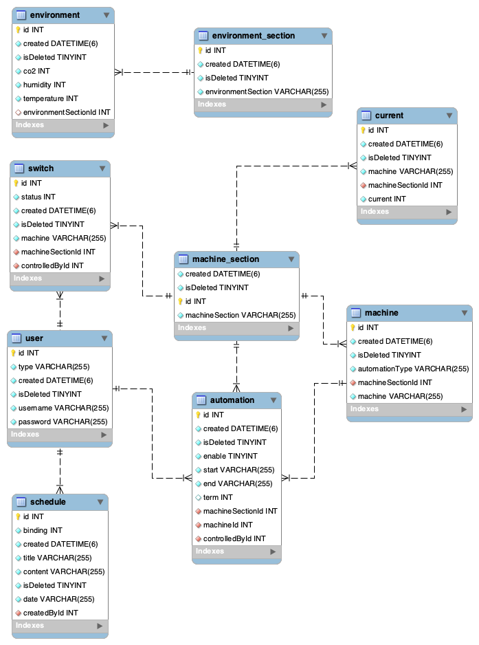
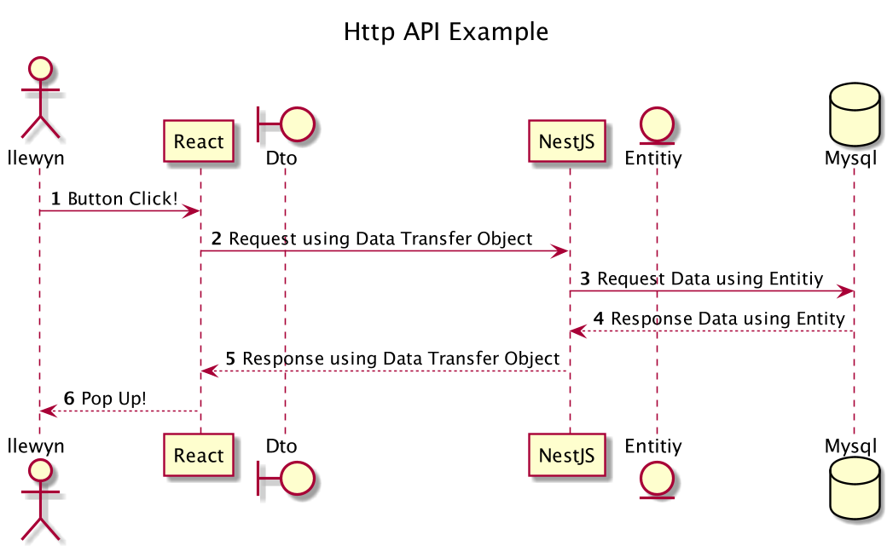
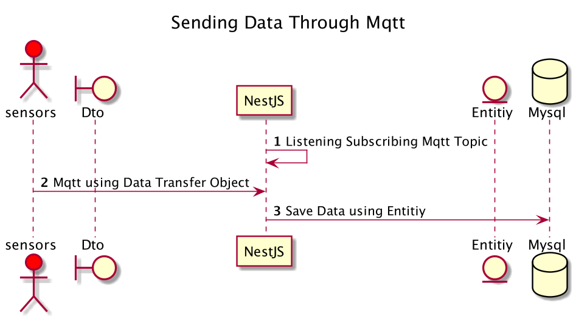
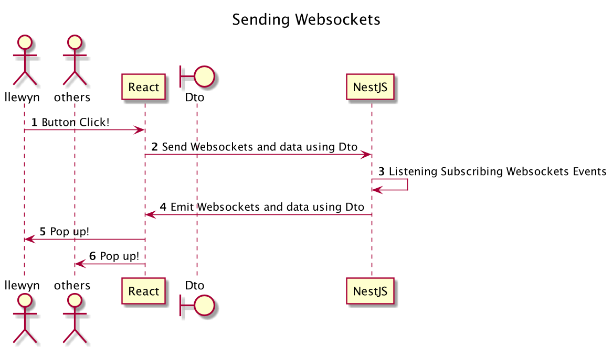

# plantpoint_backend
Backend for SmartFarm System 

### Installation

To install related packages, write a command line below on the project home directory.

```bash
npm install
```


### Prerequisite

Default server port is 9000 and websocket port is 4000. If your system block those port, should open. And To set JWT authentication, you should make a secret.ts file.

```typescript
/* plantpoint-backend/src/authentication/secret.ts */

export const jwtConstants = {
  secret: 'SECRET_STRING',
};
```


### Database Schema

With NestJS entity, this mysql database schema could be created automatically. Therefore you don't need to oragnize your own database. NestJS could do this for you.




### Project Sequence

##### 1. HTTP API FLOW




##### 2. SENSOR MQTT FLOW




##### 3. WEB SOCKET FLOW

